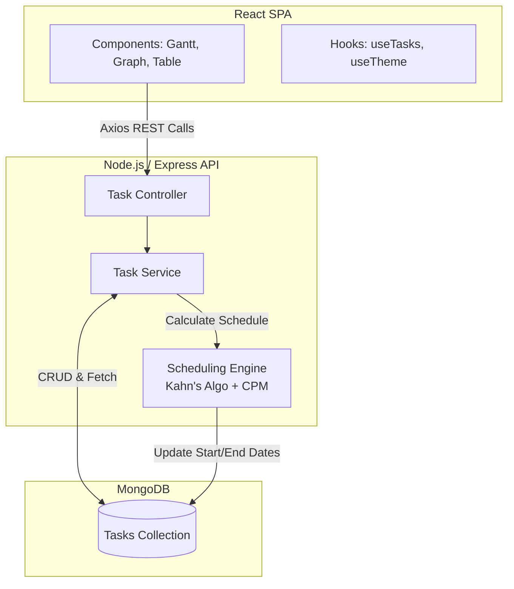
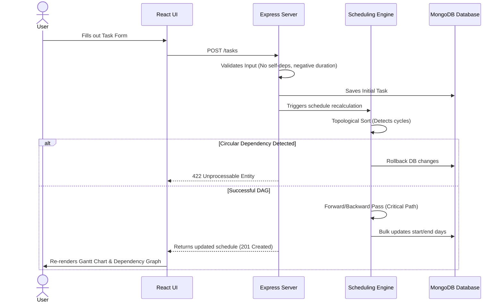
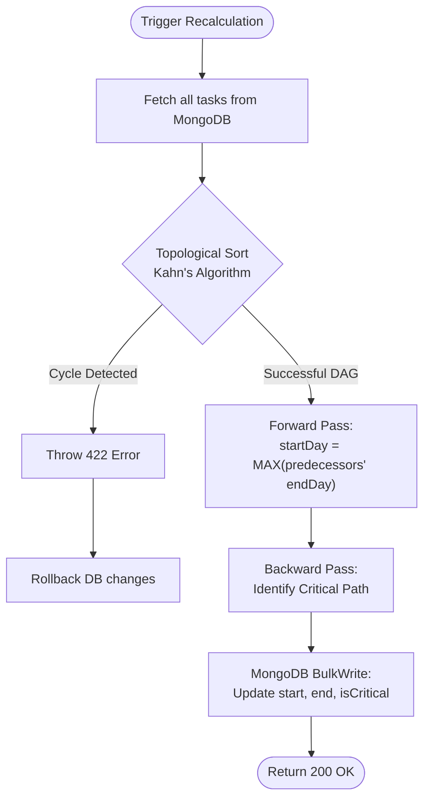

# Design Document — Mini Project Planner

## 1. System Architecture



### Design principles

| Principle | Implementation |
|-----------|----------------|
| Stability | Error boundary, try/catch in Gantt render, operational errors |
| Explainability | Pure scheduling functions, documented algorithm |
| Separation | UI never computes schedule; API owns business logic |
| Modularity | routes / controllers / services / utils |

## 2. Frontend / Backend Flow

### Create task flow



### Schedule regeneration

Triggered automatically on CRUD, or manually via **Recalculate Schedule** (`POST /tasks/schedule`).

## 3. UI Structure

```
App
└── ErrorBoundary
    └── PlannerPage
        └── Layout (header, theme toggle, stats)
            ├── ApiStatusBanner (connectivity)
            ├── Alert (API errors)
            ├── TaskForm (left sidebar)
            │   └── DependencyPicker
            ├── SidebarToolbar (recalculate, refresh)
            ├── ScheduleSummary (stat cards)
            ├── FilterBar (search, status, sort)
            ├── TaskList (work breakdown table)
            ├── GanttChart (react-google-charts Timeline)
            └── DependencyGraph (animated SVG)
```

## 4. Component Hierarchy

| Component | Responsibility |
|-----------|----------------|
| `PlannerPage` | Page orchestration, hooks wiring |
| `TaskForm` | Create task with validation |
| `TaskList` | Display, status update, delete |
| `GanttChart` | Map schedule → frappe-gantt bars |
| `DependencyGraph` | Visualize precedence edges |
| `FilterBar` | Search, status filter, sort |
| `ErrorBoundary` | Catch React render errors |

## 5. User Flows

1. **Happy path:** Create tasks → dependencies auto-schedule → view Gantt
2. **Critical path review:** Critical tasks highlighted in table + red Gantt bars
3. **Filter/sort:** Narrow task list without affecting stored schedule
4. **Error recovery:** Dismiss alert, fix input, retry

## 6. Use-Case Handling

| Use case | Behavior |
|----------|----------|
| New independent task | `startDay=0`, `endDay=duration` |
| Task with one dependency | Starts at predecessor `endDay` |
| Multiple dependencies | Starts at `MAX(predecessor endDay)` |
| Zero-duration milestone | `startDay === endDay` |
| Delete task | Removed from others' `dependencies`, reschedule |
| Status change | UI only (does not alter schedule days) |

## 7. Edge-Case Handling

| Edge case | Handling |
|-----------|----------|
| Circular dependency | Topo sort fails → 422, rollback on create |
| Self-dependency | Rejected at validation (400) |
| Invalid task ID in deps | 400 with clear message |
| Duplicate dependencies | Normalized via `Set` |
| Negative duration | Rejected (400) |
| Zero duration | Allowed; end equals start |
| Empty task list | Schedule returns empty, UI shows empty states |
| Duplicate task name | 409 Conflict |
| API failure | Axios interceptor → user-facing alert |
| Gantt render failure | Caught; fallback message, app continues |

## 8. Assumptions

- Single global project (no multi-tenant projects)
- Time unit is abstract **days** (Day 0 origin)
- Precedence-only dependencies (FS relationships)
- One schedule timeline shared by all tasks
- Gantt anchor date defaults to project creation date (stored in `localStorage`) and can be edited in the UI; backend logic uses purely relative day indices

## 9. Future Improvements

- Authentication & per-user projects
- Drag-and-drop schedule editing with constraint validation
- Resource leveling and calendar exceptions
- Real date picker (workdays/holidays)
- Optimistic UI updates with rollback

## 10. Assignment Compliance Summary

| Requirement | Status |
|-------------|--------|
| MERN stack + modular folders | Met |
| POST/GET /tasks, POST /schedule, DELETE /tasks/:id | Met (+ PATCH for status) |
| Scheduling: Day 0, MAX(deps), end = start + duration | Met |
| Gantt (library-based) | Met — `react-google-charts` Timeline |
| Edge cases (cycles, self-dep, invalid IDs, etc.) | Met |
| Advanced: status, critical path, theme, filters, dep graph | Met |
| Production stability | Enhanced — see §11 |

## 11. Reliability Enhancements (post-review)

| Enhancement | Rationale |
|-------------|-----------|
| MongoDB retry + `requireDb` middleware | Demo survives slow DB start; clear 503 vs crash |
| `GET /tasks` returns `meta` + `allTasks` | Correct project end when filtering; full Gantt |
| Dependency picker UI | Fewer invalid-ID errors; better interview UX |
| API health banner + debounced search | Visible connectivity; fewer accidental API storms |

## 12. Scalability Discussion

- **API:** Stateless; scale replicas horizontally
- **DB:** Shard by `projectId` when multi-project is added
- **Scheduling:** O(V+E) per request; cache schedule if read-heavy
- **Frontend:** Virtualize large task lists; paginate API

## 13. System Flow (Scheduling Algorithm)


